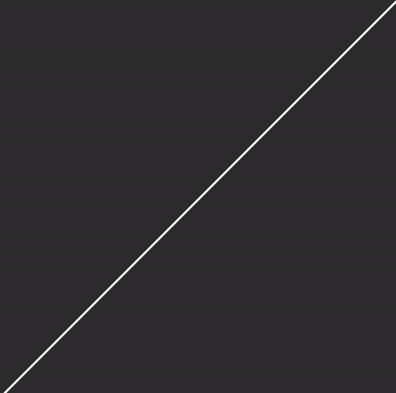

# gradient-decent-linear-regression

### Uses gradient decent to form a linear regression for some given points

Link to hosted project: [Gradient Descent Linear Regression](https://tansonlee.github.io/gradient-decent-linear-regression/)

Made with JavaScript and visualized with the p5.js library.

Click anywhere on the canvas and a line of best fit will be calculated with gradient decent.

